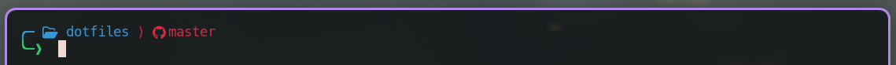
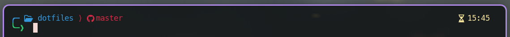
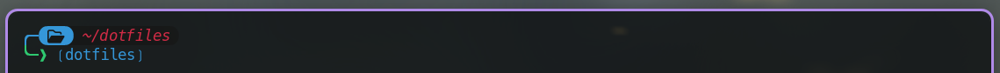

# Requirements & Installation
For you to use the bash prompts, you need to have [nerd font](https://www.nerdfonts.com/font-downloads) and [font awesome](https://fontawesome.com/download) installed. Also make sure that your terminal emulator supports their font glyphs. If you are using the `kitty` terminal emulator, then you can just insert the same `symbol_map` lines as I have included in my `kitty.conf`.

Once the fonts are installed and you have imported the bash prompt script that you want to use, you should source this file inside your `.bashrc`. Also make sure that you comment out the other `PS1` statements inside your `.bashrc`. Or just source the bash prompt file ar the end of `.bashrc`.

I think that's about it.

# simple.sh
 \
In the first line you will see your current working directory in blue and if you are inside a git repo, you will also see the branch you are in in red/pink.

Inside this file, you can also uncomment 
```bash
PS1+=$(printf "${light_yellow}%*s\r%s${reset}" "$(tput cols)" " $(date +%H:%M)" '')
```
, which adds the current time at the right:


# border.sh
This one is not done. But the idea is that it adds borders around the elements of the top line:

But the colors scheme is currently not great and it does not show the git branch or the time ... but you can add it if you want.